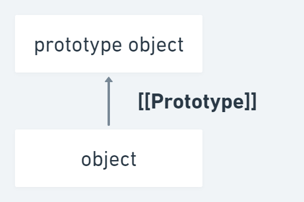
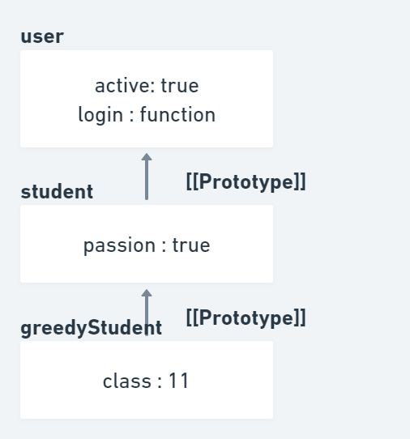
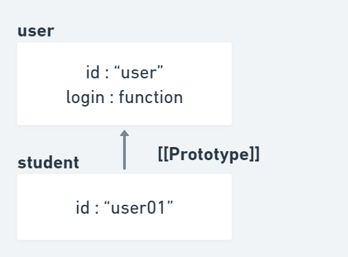
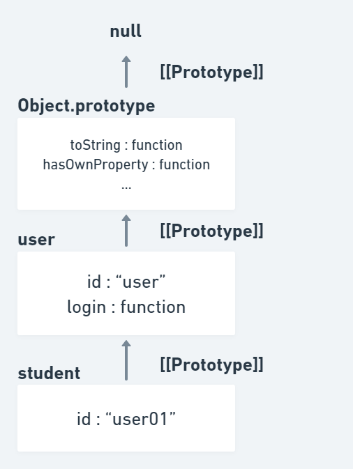
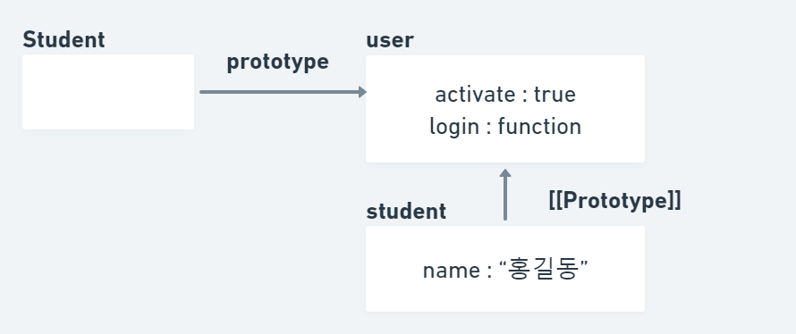
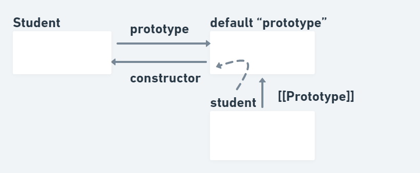
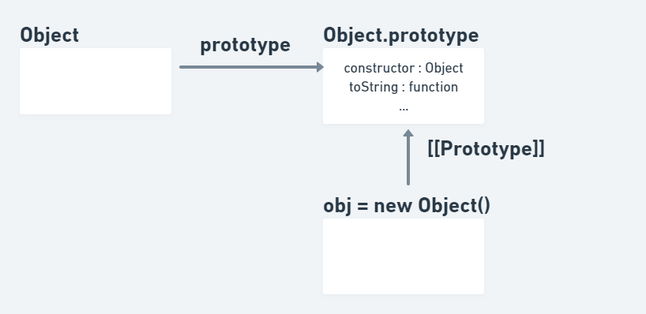
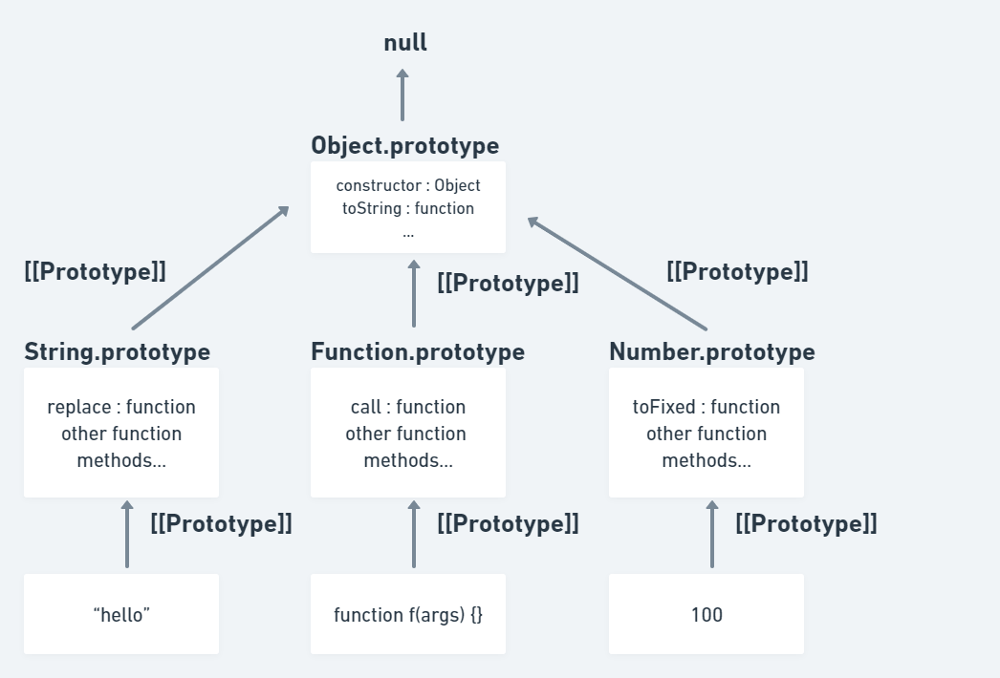

# 8. prototype

## 8-1. inheritance (상속)

### 8-1-1. [[Prototype]]
자바스크립트의 객체는 [[Prototype]]이라는 숨김 프로퍼티를 갖는다.
이 프로퍼티 값은 null이거나 다른 객체에 대한 참조가 되는데, 다른 객체를 참조하는 경우 참조 대상을 프로토타입(prototype)이라 부른다.
object에서 프로퍼티를 읽으려 할 때 해당 프로퍼티가 없으면 자바스크립트는 자동으로 프로토타입에서 프로퍼티를 찾는다.
-> `프로토타입 상속`

 

```js
const user = {
    activate : true,
    login : function(){
        console.log('로그인 되었습니다.');
    }
};

const student = {
    passion : true
};

student.__proto__ = user;

console.log(student.activate);  // 프로퍼티 activate를 student에서도 사용 가능
student.login();                // 메소드 login도 student를 통해 호출 가능
console.log(student.passion);
```

- 'student의 프로토타입은 user이다.' 혹은 'student는 user를 상속 받는다.' 라고 한다.
- 프로토타입에서 상속받은 프로퍼티를 상속 프로퍼티(inherited property)라고 한다.
- \__proto__ 는 [[Prototype]]의 getter, setter이다.
  -  요즘에는 잘 사용하지 않지만 호환을 위해 남아있으며 직관적인 이해를 돕기 위해 여기서 사용한다.
  - 이후 모던 메소드에서 소개하는 Object.getPrototypeOf나 Object.setPrototypeOf을 써서 프로토타입에 접근하는 것이 좋다.

 

```js
const greedyStudent = {
    class : 11,
    __proto__ : student
};

console.log(greedyStudent.activate);        // user에서 상속
console.log(greedyStudent.passion);         // student에서 상속
```

- 프로토타입 체이닝은 순환 참조(circle reference)가 허용되지 않는다.
- \__proto__ 의 값은 객체 또는 null만 가능하며 다른 자료형은 무시된다.

<br><br>

### 8-1-2. prototype feature


```js
const user = {
    id : 'user',
    login : function(){
        console.log(`${this.id}님 로그인 되었습니다.`);
    }
};

const student = {
    __proto__ : user
};

student.id = 'user01';
student.login();            // user01님 로그인 되었습니다.
```
- 프로토타입은 프로퍼티를 읽을 때만 사용하며 프로퍼티를 추가, 수정, 삭제하는 연산은 객체에 직접 한다.
- 메소드 내의 this는 프로토 타입에 영향받지 않으며 메소드를 객체에서 호출했든 프로토타입에서 호출했든 상관없이 this는 언제나 .앞에 있는 객체이다.
- 메소드는 공유되지만 객체의 상태는 공유되지 않는다.



```js
for(let prop in student) {
    console.log(prop);
    
    let isOwn = student.hasOwnProperty(prop);
    
    if(isOwn) {
        console.log(`객체 자신의 프로퍼티 ${prop}`);
    } else {
        console.log(`상속 프로퍼티 ${prop}`);
    }
   
}
```

- for in 반복문은 상속 프로퍼티도 순회 대상에 포함시킨다.

- hasOwnProperty : key에 대응하는 프로퍼티가 상속 프로퍼티가 아니고 obj에 직접 구현되어있는 프로퍼티일 때만 true를 반환한다.

<br><br>

## 8-2. function prototype (함수 프로토타입)

### 8-2-1. object constructor prototype (생성자 함수 프로토타입)



```js
const user = {
    activate : true,
    login : function(){
        console.log('로그인 되었습니다.');
    }
};

function Student(name) {
    this.name = name;
}

// 여기서의 prototype은 일반적인 프로퍼티
Student.prototype = user;               

// student.__proto__ == user
let student = new Student("홍길동");    

console.log(student.activate);
```

- new 연산자를 사용해 만든 객체는 생성자 함수의 프로토타입 정보를 사용해 [[Prototype]]을 설정한다.
- F.prototype은 new F를 호출할 때만 사용된다. new F를 호출할 때 만들어지는 새로운 객체의 [[Prototype]]을 할당한다.
<br><br>

### 8-2-2. function prototype and constructor property



```js
function Student() {}
// 함수를 만들기만 해도 디폴트 프로퍼티인 prototype이 설정
// Student.prototype = { constructor: Student }

console.log(Student.prototype.constructor == Student);

let student = new Student();    // // {constructor: Student}을 상속받음
console.log(student.constructor == Student); // true ([[Prototype]]을 거쳐 접근함)
```

- 개발자가 특별히 할당하지 않더라도 모든 함수는 기본적으로 "prototype" 프로퍼티를 갖는다.
- 디폴트 프로퍼티 "prototype"은 constructor 프로퍼티 하나만 있는 객체를 가리키는데, 여기서 constructor 프로퍼티는 함수 자신을 가리킨다.
<br><br>

## 8-3. built in object prototype

## 8-3-1. object prototype


```js
const obj = {};
console.log(obj.__proto__ === Object.prototype);            // true
console.log(obj.toString === obj.__proto__.toString);       // true
console.log(obj.toString === Object.prototype.toString);    // true
```

- Object는 내장 객체 생성자 함수인데 이 생성자 함수의 prototype은 toString을 비롯한 다양한 메서드가 구현되어있는 거대한 객체를 참조한다.
- new Object()를 호출하거나 리터럴 문법 {...}을 사용해 객체를 만들 때, 새롭게 생성된 객체의 [[Prototype]]은 Object.prototype을 참조한다.
<br><br>

## 8-3-2. built in object prototype



```js
const num = new Number(100);

// num은 Number.prototype을 상속받았는가?
console.log( num.__proto__ === Number.prototype ); // true

// num은 Object.prototype을 상속받았는가?
console.log( num.__proto__.__proto__ === Object.prototype ); // true

// 체인 맨 위엔 null이 있다.
console.log( num.__proto__.__proto__.__proto__ ); // null

// Number.prototype의 toString 사용
console.log(num);
console.log(num.toString());
```

- Function, String, Number을 비롯한 내장 객체들 역시 프로토타입에 메서드를 저장한다.
- 모든 내장 프로토타입의 상속 트리 꼭대기엔 Object.prototype이 있어야 한다고 규정한다.
- Object.prototype에도 메서드 toString이 있다
  - 중복 메서드가 있을 때는 체인 상에서 가까운 곳에 있는 메서드가 사용된다.
<br><br>

## 8-4. modern method

### 8-4-1. modern method

```js
const user = {
    activate: true
};
  
// Object.create(proto) : [[Prototype]]이 proto를 참조하는 빈 객체를 만듦
// 프로토타입이 user인 새로운 객체를 생성
const student = Object.create(user);
console.log(student.activate);                        // true

// Object.getPrototypeOf(obj) – obj의 [[Prototype]]을 반환
console.log(Object.getPrototypeOf(student) === user);  // true

// Object.setPrototypeOf(obj, proto) – obj의 [[Prototype]]이 proto가 되도록 설정
Object.setPrototypeOf(student, {}); // student의 프로토타입을 {}으로 변경
console.log(Object.getPrototypeOf(student) === user);  // false
```

- \__proto__ 를 getter, setter로 직접 사용하면 때문에 키가 "\__proto__"일 때 에러가 발생 하는 의도하지 않은 결과가 나올 수 있어 위와 같은 메소드를 사용하는 것이 좋다.